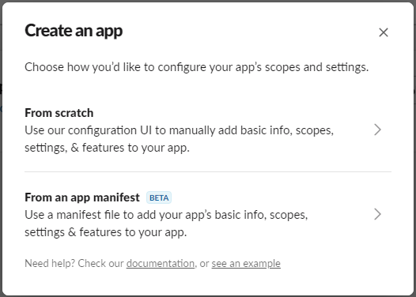
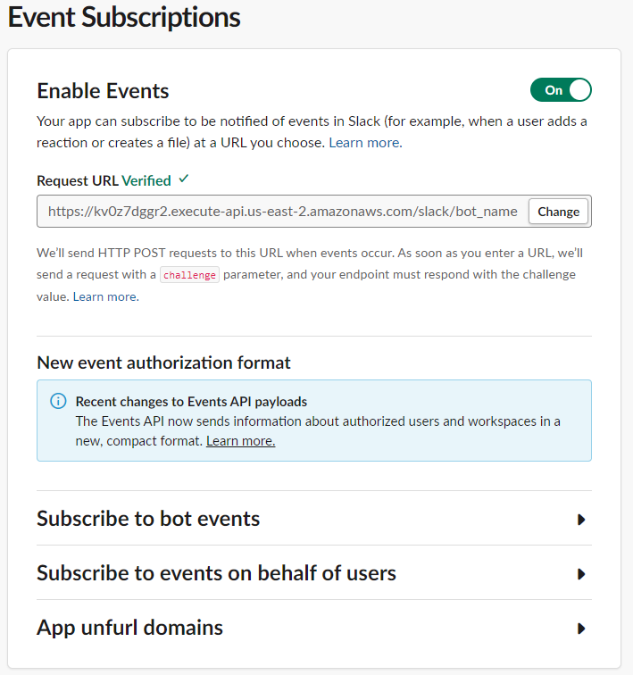
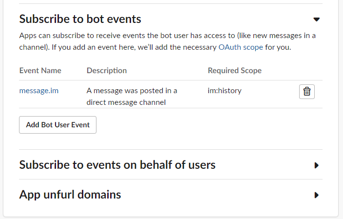

# Event-Driven ChatGPT Slack Bot <!-- omit in toc -->

*Estimated completion time: 1 hour* 
*This set of instructions is intended for beginner and those new to AWS and event-driven architecture.*

## Contents <!-- omit in toc -->

- [Prerequisites](#prerequisites)
- [Objectives](#objectives)
- [Getting Started](#getting-started)
    - [Introduction](#introduction)
    - [What is Event-Driven Architecture?](#what-is-event-driven-architecture)
    - [What is Generative AI ?](#what-is-generative-ai-)
    - [What Tools are we Using?](#what-tools-are-we-using)
- [Setup](#setup)
- [Building the Slack Bot Infrastructure](#building-the-slack-bot-infrastructure)
  - [API Gateway](#api-gateway)
  - [DynamoDB](#dynamodb)
  - [SQS](#sqs)
  - [Queue Lambda](#queue-lambda)
  - [Integrate the Lambda with the API](#integrate-the-lambda-with-the-api)
  - [Adding Slack Parameter Store Parameter](#adding-slack-parameter-store-parameter)
  - [Deploying the Application](#deploying-the-application)
  - [Creating a Slack App](#creating-a-slack-app)
    - [Create the Slack App](#create-the-slack-app)
    - [Setting up Event Subscriptions](#setting-up-event-subscriptions)
    - [Setting up OAuth \& Permissions](#setting-up-oauth--permissions)
    - [Installing the App](#installing-the-app)
    - [Update the Slack API Token in Parameter Store](#update-the-slack-api-token-in-parameter-store)
    - [Testing the Slack Bot](#testing-the-slack-bot)
  - [Create the Response Lambda](#create-the-response-lambda)
  - [Add OpenAI SDK Dependency with a Lambda Layer](#add-openai-sdk-dependency-with-a-lambda-layer)
  - [Adding OpenAI API Token Parameter Store Parameter](#adding-openai-api-token-parameter-store-parameter)
  - [Integrate the Lambda with the Queue](#integrate-the-lambda-with-the-queue)
    - [Give the Lambda Function Permission](#give-the-lambda-function-permission)
  - [Update the Slack Queue Lambda](#update-the-slack-queue-lambda)
  - [Get OpenAI API Token and Update the Parameter in Parameter Store](#get-openai-api-token-and-update-the-parameter-in-parameter-store)
  - [Update DynamoDB Table with a Persona](#update-dynamodb-table-with-a-persona)
  - [Deploying the Application, Part 2](#deploying-the-application-part-2)


## Prerequisites

- [Python 3.8](https://www.python.org/downloads/)
- [AWS CLI](https://docs.aws.amazon.com/cli/latest/userguide/cli-chap-install.html)
- [AWS CDK](https://docs.aws.amazon.com/cdk/latest/guide/getting_started.html)
- Reasonable comfort with Python and the command line.

## Objectives

- Learn how to use AWS CDK to deploy a serverless application.
- Learn how to use AWS Lambda to run code without provisioning or managing servers.
- Learn how to use AWS API Gateway to create a HTTP API.
- Learn how to use AWS DynamoDB to store and retrieve data.
- Learn how to create a Slack bot that can respond to messages.
- Learn how to use OpenAI's API.

## Getting Started

#### Introduction

_What exactly are we building?_

Within the last few years, generative AI and event-driven architecture have become increasingly popular in their own right. This workshop will combine the two to create a system that can be used to create multiple Slack bots that each have their own personalities and can respond to messages in a unique way.

To do this, we will be building the following architecture that is made up of multiple AWS services and OpenAI's API. This architecture makes use of API Gateway, Lambda, DynamoDB, SQS, and OpenAI's API. We will be managing all of these services using AWS CDK.


Before we get started, let's go over some of the concepts that we will be using in this workshop.

#### What is Event-Driven Architecture?

> Event-driven architecture is a software architecture pattern promoting the production, detection, consumption of, and reaction to events. 

Compared to traditional request-response architecture, a client sends a request and expects a response before performing the next task. In event-driven architecture, the client generates an event and can immediately move on to its next task.

In the context of this workshop, an event is the request we recieve from the Slack API. Once we recieve that event, we will immediately send a response back to Slack and queue up a task to generate a response to the event.

#### What is Generative AI ?

> Generative artificial intelligence or generative AI (also GenAI) is a type of artificial intelligence (AI) system capable of generating text, images, or other media in response to prompts. ([Wikipedia](https://en.wikipedia.org/wiki/Generative_artificial_intelligence))

Unlike other forms of simple AI, generative AI is capable of creating novel content on its own. OpenAI has been at the forefront of this technology, and has created a variety of generative AI models that can be used to create text, images, and more. Most notably, they have created the models behind [ChatGPT](https://openai.com/blog/openai-api/) (*Which, if you haven't already played with, you should!*).

#### What Tools are we Using?

##### AWS CDK

AWS CDK is a software development framework for defining cloud infrastructure in code and provisioning it through AWS CloudFormation. It allows you to define your infrastructure using a familiar programming language, which in our case means Python. This will allows to create all of our infrastructure using Python, which will make it easier to manage and deploy.

##### AWS API Gateway

To communicate with our Slack bot, we will be using AWS API Gateway to create a HTTP API. This API will allow us to receive messages from Slack; we can then process these messages accordingly and send a response back to Slack.

##### OpenAI API

The OpenAI API will allow us to send request to some of OpenAI's models programmatically. so we can use it generate our Slack bot's responses. We will be using the ChatGPT model to generate our responses.

##### AWS Lambda

AWS Lambda is a serverless compute service that lets you run code without provisioning or managing servers. Lambda will allow us to run our code without having to worry about managing servers or scaling our application.

##### AWS DynamoDB

AWS DynamoDB is a fully managed NoSQL database service that provides fast and predictable performance with seamless scalability. We will be using DynamoDB to store the information that guarantees that our Slack bot will have a unique personality.

##### AWS SQS

Slack unfortunately has a limit on how quickly it expects a response from our API, which is 3 seconds as of writing. This means that we have to respond to Slack within 3 seconds, or else it will assume that our API is down. OpenAI's API can take longer than 3 seconds to respond... which presents a problem for us. Even more unfortunately, Lambda functions are not able to return an HTTP response and keep running. This means that we have to find a way to respond to Slack within 3 seconds, while also running our code. To do this, we will be using AWS SQS to decouple our response to the Slack event from our code that calls OpenAI's API. This will allow us to respond to Slack within 3 seconds, make our call to OpenAI's API, and then send our response to Slack.

## Setup

Alright, now that we have a better understanding of what we are building, let's get started!

This project is set up like a standard Python project. As part of the setup, we will be creating a virtual environment for our project dependencies. To create the virtual environment, we will be using `venv`. If you do not have `venv` installed, you can install it by running the following command:

1. If you have no already, ensure you have setup the AWS CLI and configured your credentials. You can find instructions on how to do that [here](https://docs.aws.amazon.com/cli/latest/userguide/cli-chap-install.html).

2. Clone this repository to your local machine.

```bash
git clone <insert later>
```

3. First, we will create a virtual environment for our project dependencies.

```bash
python3 -m venv .venv
```

4. (*Mac/Linux*) After the init process completes and the virtualenv is created, you can use the following

```
$ source .venv/bin/activate
```

4. (*Windows*) After the init process completes and the virtualenv is created, you can use the following
```
% .venv\Scripts\activate.bat
```

5. Once the virtualenv is activated, you can install the required dependencies.

```
$ pip install -r requirements.txt
```

6. At this point you can now synthesize the CloudFormation template for this code.

```
$ cdk synth
```

Congratulations! You have now setup your environment and are ready to start building!

## Building the Slack Bot Infrastructure

### API Gateway

At the front of our architecture is the API that will ingest the events from Slack. We will be using a HTTP API to do this, which is a new type of API that was recently released by AWS. To create this API, we will be using the `HttpApi` construct from the `aws_cdk.aws_apigatewayv2` module.

To set this up, navigate to the `pipeline.py` file and add the following code:

```python
http_api = aws_apigwv2.HttpApi(self, "HttpAPI",
    api_name="http-api",
)
```

This will create a new HTTP API named `http-api`. We will be using this API to receive events from Slack.

### DynamoDB

Next, we will create a DynamoDB table that will store the information that will be used to generate our Slack bot's responses. To do this, we will be using the `Table` construct from the `aws_cdk.aws_dynamodb` module.

To set this up, navigate to the `pipeline.py` file and before the API, add the following code:

```python
table = aws_dynamodb.Table(
    self,
    f"{self.stack_name}-personas",
    table_name=f"{self.stack_name}-personas",
    partition_key=aws_dynamodb.Attribute(
        name="name",
        type=aws_dynamodb.AttributeType.STRING
    ),
    billing_mode=aws_dynamodb.BillingMode.PAY_PER_REQUEST,
)
```

### SQS

Next, we will create a SQS queue that will be used to queue up the tasks to generate our Slack bot's responses. To do this, we will be using the `Queue` construct from the `aws_cdk.aws_sqs` module.

To set this up, navigate to the `pipeline.py` file after the DynamoDB table and before the API, add the following code:

```python
queue = aws_sqs.Queue(
    self,
    f"{self.stack_name}-queue",
    queue_name=f"{self.stack_name}-queue",
    visibility_timeout=Duration.seconds(300)
)
```

### Queue Lambda

Now that we have our API, DynamoDB table, and SQS, we can start building out our Lambda functions. The first Lambda function we will create is the one that will be triggered by our API. This function will be responsible for receiving the event from Slack, adding it to the queue, and sending a response back to Slack.

To create this function, we will be using the `Python Function` construct from the `aws_cdk.aws_lambda_python` module. This construct will allow us to create a Lambda function using Python.

To set this up, navigate to the `pipeline.py` file and before the DynamoDB table, add the following code:

```python
queue_fn = aws_lambda_python_alpha.PythonFunction(
    self,
    f"{self.stack_name}-slack-queue",
    function_name=f"{self.stack_name}-slack-queue",
    runtime=aws_lambda.Runtime.PYTHON_3_8,
    index="main.py",
    handler="handler",
    entry="lambdas/slack_queue",
    environment={
        "SQS_QUEUE_URL": queue.queue_url
    }
)
```

You'll notice that the entry point for this function is `lambdas/slack_queue`. This is the directory that contains the code for this function. Create a new directory named `lambdas` and create a new directory named `slack_queue` inside of it. Inside of the `slack_queue` directory, create a new file named `main.py`. This is where we will be writing the code for this function.

Now that we have our function created, let's add the code to it. Open up the `main.py` file and add the following code:

```python
import boto3
import json
import os
import urllib

ssm_client = boto3.client('ssm')

SLACK_BOT_TOKEN = ssm_client.get_parameter(
        Name=os.environ['SSM_SLACK_TOKEN'], 
        WithDecryption=True
    )['Parameter']['Value']

def send_slack_message(channel_id, response_text):
    print("Messaging Slack...")

    # Slack API endpoint
    SLACK_URL = "https://slack.com/api/chat.postMessage"

    # Encode data for POST request
    data = urllib.parse.urlencode(
        (
            ("token", SLACK_BOT_TOKEN),
            ("channel", channel_id),
            ("text", response_text)
        )
    )
    data = data.encode("ascii")

    # Create POST request
    request = urllib.request.Request(SLACK_URL, data=data, method="POST")
    request.add_header( "Content-Type", "application/x-www-form-urlencoded" )

    # Send request
    urllib.request.urlopen(request).read()


def handle_challenge(slack_event):
    challenge_value = slack_event.get("challenge", None)

    if challenge_value is not None:
        return {
            'statusCode': 200,
            'body': challenge_value
        }
    
    return None


def handle_bot(slack_event):
    is_bot_event = slack_event.get("event").get("bot_id", None) is not None

    if is_bot_event:
        return {
            'statusCode': 200,
            'body': json.dumps({ 'message': 'Bot triggered this event' })
        }

    return None


def handle_message(slack_event):
    # Extract the channel ID and text from the Slack event
    channel_id = slack_event.get("event").get("channel")

    send_slack_message(channel_id, "Hello World!")


def handler(event, context):
    try:
        # Extracting persona and body from the event
        request_body = event.get("body")

        # Parsing the request body into a JSON object
        slack_event = json.loads(request_body)

        # Printing the Slack event to the logs
        # so we can verify what the event looks like for debugging.
        print(f"Slack event: {slack_event}")

        # Handling Slack challenge
        handle_challenge_response = handle_challenge(slack_event)
        if handle_challenge_response is not None:
            return handle_challenge_response

        # Handling messages from Slack Bot itself (ignore them)
        handle_bot_response = handle_bot(slack_event)
        if handle_bot_response is not None:
            return handle_bot_response

        # Handling Slack messages
        message_response = handle_message(slack_event)
        return message_response       

    except Exception as e:
        print(e)
        return {
            'statusCode': 500,
            'body': json.dumps({ 'message': 'Error processing message' })
        }
```

You do not need to worry too much about the code in this function just yet as it is not complete. We will be coming back to this function later to finish it up.

Right now at a high level, this function will receive an event from Slack, parse it, and then if it is a Slack challenge it will respond to it, otherwise it will send the message 
Hello World!" to Slack. *A Slack challenge is a request that Slack sends to your API to verify that it is working correctly. We will be using this to verify that our API is working correctly.*

### Integrate the Lambda with the API

Now that we have our Lambda function created, we need to integrate it with our API. To do this, we will do two things: create a new API integration and add a new route to our API.

To create the API integration, navigate to the `pipeline.py` file and after the API and Lambda function declaration, add the following code:

```python
slack_queue_integration = HttpLambdaIntegration(
    f"{self.stack_name}-slack-queue-integration",
    slack_queue_fn
)
```

Next, we need to add a new route to our API. To do this, navigate to the `pipeline.py` file and after the API integration, add the following code:

```python
http_api.add_routes(
    path="/slack/{persona}",
    methods=[aws_apigwv2.HttpMethod.POST],
    integration=slack_integration
)
```

### Adding Slack Parameter Store Parameter

You might have noticed that we are using the `SSM_SLACK_TOKEN` environment variable in our Lambda function. This variable is used to store the Slack bot token that we will be using to send messages to Slack. To create this parameter, we will be using the `StringParameter` construct from the `aws_cdk.aws_ssm` module.

To set this up, navigate to the `pipeline.py` file and before the API integration and after the function declaration, add the following code:

```python
ssm_slack_token = aws_ssm.StringParameter(
    self,
    f"{self.stack_name}-slack-token",
    parameter_name=f"{self.stack_name}-slack-token",
    string_value="CHANGE_ME",
)
```

You will also need to give the Lambda function permission to access this parameter. To do this, navigate to the `pipeline.py` file and after the parameter declaration, add the following code:

```python
ssm_slack_token.grant_read(slack_respond_fn)
```

Alright, now that this is all done, let's deploy our application and see what we have so far!

### Deploying the Application

At this point, your `pipeline.py` file should look something like this:

```python
from aws_cdk import (
    Stack,
    Duration,
    aws_apigatewayv2_alpha as aws_apigwv2,
    aws_dynamodb,
    aws_lambda,
    aws_lambda_event_sources,
    aws_lambda_python_alpha,
    aws_sqs,
    aws_ssm
)
from constructs import Construct
from aws_cdk.aws_apigatewayv2_integrations_alpha import HttpLambdaIntegration

class SentimentAnalysisPipelineStack(Stack):
    def __init__(self, scope: Construct, construct_id: str, **kwargs) -> None:
        super().__init__(scope, construct_id, **kwargs)

        ########################################################
        # A DynamoDB table
        ########################################################

        # Create a DynamoDB table
        personas_table = aws_dynamodb.Table(
            self,
            f"{self.stack_name}-personas",
            table_name=f"{self.stack_name}-personas",
            partition_key=aws_dynamodb.Attribute(
                name="name",
                type=aws_dynamodb.AttributeType.STRING
            ),
            billing_mode=aws_dynamodb.BillingMode.PAY_PER_REQUEST,
        )

        ########################################################
        # SQS Queue
        ########################################################

        # Create an SQS queue to hold the messages.
        queue = aws_sqs.Queue(
            self,
            f"{self.stack_name}-queue",
            queue_name=f"{self.stack_name}-queue",
            visibility_timeout=Duration.seconds(300)
        )

        ########################################################
        # A Lambda function
        ########################################################

        slack_queue_fn = aws_lambda_python_alpha.PythonFunction(
            self,
            f"{self.stack_name}-slack-queue",
            function_name=f"{self.stack_name}-slack-queue",
            runtime=aws_lambda.Runtime.PYTHON_3_8,
            index="main.py",
            handler="handler",
            entry="lambdas/slack_queue",
            environment={
                "SQS_QUEUE_URL": queue.queue_url
            }
        )

        ########################################################
        # An HTTP API integration
        ########################################################

        slack_integration = HttpLambdaIntegration(
            f"{self.stack_name}-slack-integration",
            slack_queue_fn
        )
                                              
        ########################################################
        # An HTTP API
        ########################################################

        http_api.add_routes(
            path="/slack/{persona}",
            methods=[aws_apigwv2.HttpMethod.POST],
            integration=slack_integration
        )
```

Now, let's deploy our application and see what we have so far. To do this, run the following command:

```bash
cdk deploy
```

Once the deployment is complete, visit the API Gateway console and click on the `http-api` API. Here, you will see the URL for your API. Copy this URL and navigate to the `https://api.slack.com/apps` page. Here, you will create a new Slack app that will send events to our API.

### Creating a Slack App

#### Create the Slack App

Now that we have our API deployed, we need to create a Slack app that will send events to our API. To do this, we will be using the [Slack API](https://api.slack.com/). If you do not already have a Slack account, you can create one [here](https://slack.com/get-started#/).

Once you have created your Slack account, navigate to the `https://api.slack.com/apps` page and click on the `Create New App` button.



Here, you will create the app "From Scratch". Give your app a name and select the workspace that you want to create the app in. Once you have done that, click on the `Create App` button.


#### Setting up Event Subscriptions

Once you have created your app, you will be taken to the app's dashboard. Here, you will be able to configure your app. The first thing we need to do is go to "Event Subscriptions" and enable events for our app.

Here, you can add the URL under "Request URL" that we copied from the API Gateway console. Note, you will need to add `/slack/{persona}` to the end of the URL. Inside {persona}, you can add any name you want. This name will be used to identify the persona that will be used to generate the Slack bot's responses. For example, if you add `bot_name` to the end of the URL, the URL should look something like this: `https://<api-id>.execute-api.<region>.amazonaws.com/slack/bot_name`. *Feel free to give it a silly or fun name, you can change it later if you want.*



Once you have added the URL, you can click on the `Save Changes` button.

Next, we need to add the events that we want to subscribe to. To do this, click on the `Subscribe to bot events` button. Here, we will add the `message.im` event. This event will be triggered whenever a user sends a message to our Slack bot. You can also add other events if you want, but for this workshop we will only be using the `message.im` event.



With the events added, we can now click on the `Save Changes` button.

#### Setting up OAuth & Permissions

Next, navigate to the `OAuth & Permissions` page. Here, we can add the scopes that our app will need to function. To do this, scroll down to the `Scopes` section and add the following scopes:
```
chat:write
im:history
im:read
im:write
mpim:read
mpim:write
```


#### Installing the App

Alright, we are almost done! The last thing we need to do is install our app to our workspace. To do this, navigate to the `Install App` page. Here, you will see a button that says `Install App to Workspace`. Click on this button and follow the instructions to install the app to your workspace.

#### Update the Slack API Token in Parameter Store

Now that we have installed our app, we need to update the `SSM_SLACK_TOKEN` parameter in Parameter Store with the Slack API token. First, grab the "Bot User OAuth Token" from the "Install App" page. This is the token that we will be using to send messages to Slack. 

Once you have copied the token, navigate to the `Parameter Store` page in the AWS console. Here, you will see a parameter named `slack-token`. Click on this parameter and then click on the `Edit` button. Here, you can paste in the Slack API token that you copied from the Slack API page. Once you have done that, click on the `Save changes` button.

#### Testing the Slack Bot

Once you have installed the app, you can test it out by sending a message to your Slack bot. If everything is working correctly, you should see a response from your Slack bot!

### Create the Response Lambda

Remember, the Slack API requires a message to be sent back within 3 seconds. This means that we cannot call OpenAI's API directly from our Lambda function. To get around this, we will be using SQS to queue up the tasks to generate our Slack bot's responses. This will allow us to respond to Slack within 3 seconds, while also calling OpenAI's API.

To do this, we will create a new Lambda function that will be triggered by the SQS queue. This function will be responsible for generating our Slack bot's responses. To create this function, we will be using the `Python Function` construct from the `aws_cdk.aws_lambda_python` module. This construct will allow us to create a Lambda function using Python.

To set this up, navigate to the `pipeline.py` file and after the API, add the following code:

```python
slack_respond_fn = aws_lambda_python_alpha.PythonFunction(
    self,
    f"{self.stack_name}-slack-respond",
    function_name=f"{self.stack_name}-slack-respond",
    runtime=aws_lambda.Runtime.PYTHON_3_8,
    index="main.py",
    handler="handler",
    entry="lambdas/slack_respond",
    environment={
        "TABLE_NAME": personas_table.table_name,
        "SSM_OPENAI_API_KEY": ssm_openai_key.parameter_name,
        "SSM_SLACK_TOKEN": ssm_slack_token.parameter_name,
        "MAX_OPENAI_TOKENS": "150"
    },
    layers=[openai_layer],
    timeout=Duration.seconds(300)
)
```

As with our previous Lambda function, the entry point for this function is `lambdas/slack_respond`. This is the directory that contains the code for this function. Create a new directory named `lambdas` and create a new directory named `slack_respond` inside of it. Inside of the `slack_respond` directory, create a new file named `main.py`. This is where we will be writing the code for this function.

```python
import boto3
import json
import os
import openai
import urllib

# Create a DynamodDB and SQS clients outside of the handler function so we can reuse the
# clients between invocations. For more information on Boto3 clients, see:
# https://boto3.amazonaws.com/v1/documentation/api/latest/guide/clients.html
dynamodb_client = boto3.resource('dynamodb')
ssm_client = boto3.client('ssm')

# Global variables
SLACK_BOT_TOKEN = ssm_client.get_parameter(
    Name=os.environ['SSM_SLACK_TOKEN'], 
    WithDecryption=True
    )['Parameter']['Value']

OPENAI_API_KEY = ssm_client.get_parameter(
    Name=os.environ['SSM_OPENAI_API_KEY'], 
    WithDecryption=True
    )['Parameter']['Value']

MAX_OPENAI_TOKENS = int(os.environ['MAX_OPENAI_TOKENS'])

# Set OpenAI API key from Parameter Store
openai.api_key = OPENAI_API_KEY


def send_slack_message(channel_id, response_text):
    """
    Sends a message to a Slack channel using the chat.postMessage API method.

    Args:
        channel_id (str): The ID of the Slack channel to send the message to.
        response_text (str): The text of the message to send.
    """
    print("Messaging Slack...")

    # Slack API endpoint
    SLACK_URL = "https://slack.com/api/chat.postMessage"

    # Encode data for POST request
    data = urllib.parse.urlencode(
        (
            ("token", SLACK_BOT_TOKEN),
            ("channel", channel_id),
            ("text", response_text)
        )
    )
    data = data.encode("ascii")

    # Create POST request
    request = urllib.request.Request(SLACK_URL, data=data, method="POST")
    request.add_header( "Content-Type", "application/x-www-form-urlencoded" )

    # Send request
    urllib.request.urlopen(request).read()


def process(persona_name, prompt):
    """
    Processes a user prompt with a persona from our SQS queue, 
    finds the persona in DynamoDB, uses the persona to generate a response
    from OpenAI, and sends the response to Slack.

    Args:
        persona_name (str): The name of the persona to use.
        prompt (str): The user prompt to process.

    Returns:
        dict: A 200 response if the event is from a bot, None otherwise.

    Raises:
        e: Any exception raised by the function will be raised to the caller.
    """

    # Retrieve persona from DynamoDB
    table = dynamodb_client.Table(os.environ['TABLE_NAME'])
    persona = table.get_item(
        Key={
            'name': persona_name
        }
    )
    persona_body = persona['Item']['persona']

    # Generate response from OpenAI
    response = openai.ChatCompletion.create(
        model="gpt-3.5-turbo",
        messages=[
            {
            "role": "system",
            "content": persona_body
        },
        {
            "role": "user",
            "content": prompt
        }
        ],
        max_tokens=MAX_OPENAI_TOKENS,
    )

    # Extract response message from OpenAI API response
    return response['choices'][0]['message']['content']


def handler(event, context):
    """
    A trigger function to process a user prompt with a persona from our SQS queue,
    find the persona in DynamoDB, use the persona to generate a response
    from OpenAI, and send the response to Slack.

    Args:
        event (dict): The event that triggered the Lambda function
        context (dict): The context in which the Lambda function was called

    Returns:
        dict: A 200 response indicating that the message was sent successfully.
    
    Raises:
        e: Any exception raised by the function will be raised to the caller.
    """

    try:
        print("Eveent received. Processing...")

        # Printing the Slack event to the logs for debugging
        print(f"SQS event: {message}")

        # Retrieve message from SQS queue.
        # The message is a JSON object with the channel ID, text, and persona.
        # For more on SQS events, see:
        # https://docs.aws.amazon.com/lambda/latest/dg/with-sqs.html
        sqs_message = event['Records'][0]['body']
        message = json.loads(sqs_message)

        # Printing the Slack message to the logs for debugging
        print(f"SQS message: {message}")

        # Extract message data from SQS message
        channel_id = message['channel_id']
        text = message['text']
        persona_name = message['persona']

        # Process user prompt with persona and send response to Slack
        response = process(persona_name, text)
        send_slack_message(channel_id, response)

        # Return HTTP response
        return {
            'statusCode': 200,
            'body': json.dumps({ 'message': 'Message sent successfully' })
        }

    except Exception as e:
        print(e)
        return {
            'statusCode': 500,
            'body': json.dumps({ 'message': 'Error processing message' })
        }
```

### Add OpenAI SDK Dependency with a Lambda Layer

You might notice one key thing about our function, it has a dependency on the `openai` package. This package is not included in the standard Python runtime, which means that we need to include it in our Lambda function. To do this, we will be using Lambda layers. Lambda layers allow us to include additional code and content to our Lambda function. To create a Lambda layer, we will be using the `LayerVersion` construct from the `aws_cdk.aws_lambda` module.

Before that lambda in the `pipeline.py` file, add the following code:

```python
openai_layer = aws_lambda_python_alpha.PythonLayerVersion(
    self,
    f"{self.stack_name}-openai-layer",
    entry="layers/openai",
    layer_version_name=f"{self.stack_name}-openai-layer",
    compatible_runtimes=[aws_lambda.Runtime.PYTHON_3_8],
)
```

Similar to our Lambda function, the entry point for this layer is `layers/openai`. This is the directory that contains the code for this layer. Create a new directory named `layers` and create a new directory named `openai` inside of it. Inside of the `openai` directory, create a new file named `requirements.txt`. This is where we will be adding the dependencies for our layer. Add the following code to the `requirements.txt` file:

```
openai==0.27.6
urllib3<2
```

That is all we need to do to create our layer! If you would like to learn more about Lambda layers, you can find more information [here](https://docs.aws.amazon.com/lambda/latest/dg/configuration-layers.html).

### Adding OpenAI API Token Parameter Store Parameter

Remember the parameter that we created earlier in parameter store? We will be doing the same thing for our OpenAI API key. To do this, navigate to the `pipeline.py` file and before the API integration and after the function declaration, add the following code:

To set this up, navigate to the `pipeline.py` file and before the API integration and after the function declaration, add the following code:

```python
ssm_openai_key = aws_ssm.StringParameter(
    self,
    f"{self.stack_name}-openai-api-key",
    parameter_name=f"{self.stack_name}-openai-api-key",
    string_value="CHANGE_ME",
)
```

### Integrate the Lambda with the Queue

Right now, our Lambda function is not integrated with our SQS queue. To integrate it, we will be using the `SqsEventSource` construct from the `aws_cdk.aws_lambda_event_sources` module.

To set this up, navigate to the `pipeline.py` file and after the Lambda function, add the following code:

```python
# Create an SQS trigger for the Lambda function
slack_respond_fn.add_event_source(
    aws_lambda_event_sources.SqsEventSource(
        queue=queue,
        batch_size=1
    )
)
```

#### Give the Lambda Function Permission

Now that we have our Lambda function integrated with our SQS queue, we need to give it permission to access the queue as well as the DynamoDB table. To do this, navigate to the `pipeline.py` file and after the Lambda function, add the following code after the SQS trigger:

```python
# Give the Lambda function permissions to read from the SQS queue
queue.grant_send_messages(slack_queue_fn)

# Give the Lambda function permissions to read from the DynamoDB table
personas_table.grant_read_data(slack_respond_fn)
```

### Update the Slack Queue Lambda

Our current Slack queue Lambda function is not complete. We need to update it to send the message to the SQS queue. To do this, open up the `main.py` file and update the `handle_message` function to the following:

```python
def handle_message(slack_event, persona):
    """
    A function to handle a message event from Slack. This will send the
    message to the SQS queue for processing since we cannot guarantee
    that the Lambda function will be able to process the message in
    the 3 second timeout that Slack expects.
    For more information on message events, see:
    https://api.slack.com/events/message

    Args:
        slack_event (dict): The event dictionary from the Slack event
        persona (str): The name of the persona to use for the message
        
    Returns:
        dict: A 200 response indicating that the message was processed successfully.
    """

    # Extract the channel ID and text from the Slack event
    channel_id = slack_event.get("event").get("channel")
    text = slack_event.get("event").get("text")

    # Send the channel ID, text, and persona to the SQS queue
    sqs_queue = sqs_client.Queue(SQS_QUEUE_URL)
    sqs_queue.send_message(
        MessageBody=json.dumps({
            'channel_id': channel_id,
            'text': text,
            'persona': persona
        })
    )

    return {
        'statusCode': 200,
        'body': json.dumps({ 'message': 'Message processed successfully' })
    }
```

No longer will we be sending the message directly to Slack, instead we will be sending it to the SQS queue. This will allow us to respond to Slack within 3 seconds, while also calling OpenAI's API.

### Get OpenAI API Token and Update the Parameter in Parameter Store

Before we can run our code, we need to get an API key for OpenAI's API. To do this, navigate to the [OpenAI Platform Page](https://platform.openai.com/) and either create an account or sign in. Once you have done that, you will be taken to the dashboard.

Here, go to the top-right menu and select "View API keys" from the dropdown. Here, you can create a new API key. Once you have created the API key, we need to update the `openai-api-key` parameter in Parameter Store with the OpenAI API Token. 

Once you have copied the token, navigate to the `Parameter Store` page in the AWS console. Here, you will see a parameter named `openai-api-key`. Click on this parameter and then click on the `Edit` button. Here, you can paste in the OpenAI API token that you copied earlier. Once you have done that, click on the `Save changes` button.

### Update DynamoDB Table with a Persona

Remember that we created a DynamoDB table earlier? We need to add a persona to this table. Our table's partition key is `name`, which means that we need to add a persona with the name that we used in our API URL. To do this, navigate to DynamoDB in the AWS console and click on the table that you created earlier. Here, you will see a button that says `Create item`. Click on this button and add the following data:

```
{
    "name": "<persona-name>",
    "persona": "<persona-text>"
}
```

`<persona-name>` Should match with the endpoint that you are using for your API. For example, if your API URL is `https://<api-id>.execute-api.<region>.amazonaws.com/slack/bot_name`, then `<persona-name>` should be `bot_name`.

`<persona-text>` Should be the persona that you want to use to generate your Slack bot's responses. For example, if you want your Slack bot to respond as Shakespeare, you can use the following persona:

```
You are William Shakespeare, the English poet, playwright, and actor. You are widely regarded as the greatest writer in the English language and the world's greatest dramatist. You should speak in a poetic voice and use poetic language. Please keep your responses short and to the point as you are talking with people who do not like to read long walls of text.
```

### Deploying the Application, Part 2

At this point, your `pipeline.py` file should look something like this:

```python
from aws_cdk import (
    Stack,
    Duration,
    aws_apigatewayv2_alpha as aws_apigwv2,
    aws_dynamodb,
    aws_lambda,
    aws_lambda_event_sources,
    aws_lambda_python_alpha,
    aws_sqs,
    aws_ssm
)
from constructs import Construct
from aws_cdk.aws_apigatewayv2_integrations_alpha import HttpLambdaIntegration

class SentimentAnalysisPipelineStack(Stack):
    def __init__(self, scope: Construct, construct_id: str, **kwargs) -> None:
        super().__init__(scope, construct_id, **kwargs)

        ########################################################
        # A DynamoDB table
        ########################################################

        # Create a DynamoDB table
        personas_table = aws_dynamodb.Table(
            self,
            f"{self.stack_name}-personas",
            table_name=f"{self.stack_name}-personas",
            partition_key=aws_dynamodb.Attribute(
                name="name",
                type=aws_dynamodb.AttributeType.STRING
            ),
            billing_mode=aws_dynamodb.BillingMode.PAY_PER_REQUEST,
        )

        ########################################################
        # SQS Queue
        ########################################################

        # Create an SQS queue to hold the messages.
        queue = aws_sqs.Queue(
            self,
            f"{self.stack_name}-queue",
            queue_name=f"{self.stack_name}-queue",
            visibility_timeout=Duration.seconds(300)
        )

        ########################################################
        # Parameter Store
        ########################################################

        # Create a Parameter Store parameter to hold 
        # the Slack bot token and OpenAI API key.
        
        ssm_slack_token = aws_ssm.StringParameter(
            self,
            f"{self.stack_name}-slack-token",
            parameter_name=f"{self.stack_name}-slack-token",
            string_value="CHANGE_ME",
        )

        ssm_openai_key = aws_ssm.StringParameter(
            self,
            f"{self.stack_name}-openai-api-key",
            parameter_name=f"{self.stack_name}-openai-api-key",
            string_value="CHANGE_ME",
        )

        ########################################################
        # Lambda Layer
        ########################################################

        openai_layer = aws_lambda_python_alpha.PythonLayerVersion(
            self,
            f"{self.stack_name}-openai-layer",
            entry="layers/openai",
            layer_version_name=f"{self.stack_name}-openai-layer",
            compatible_runtimes=[aws_lambda.Runtime.PYTHON_3_8],
        )

        ########################################################
        # A Lambda function
        ########################################################

        slack_queue_fn = aws_lambda_python_alpha.PythonFunction(
            self,
            f"{self.stack_name}-slack-queue",
            function_name=f"{self.stack_name}-slack-queue",
            runtime=aws_lambda.Runtime.PYTHON_3_8,
            index="main.py",
            handler="handler",
            entry="lambdas/slack_queue",
            environment={
                "SQS_QUEUE_URL": queue.queue_url
            }
        )

        slack_respond_fn = aws_lambda_python_alpha.PythonFunction(
            self,
            f"{self.stack_name}-slack-respond",
            function_name=f"{self.stack_name}-slack-respond",
            runtime=aws_lambda.Runtime.PYTHON_3_8,
            index="main.py",
            handler="handler",
            entry="lambdas/slack_respond",
            environment={
                "TABLE_NAME": personas_table.table_name,
                "SSM_OPENAI_API_KEY": ssm_openai_key.parameter_name,
                "SSM_SLACK_TOKEN": ssm_slack_token.parameter_name,
                "MAX_OPENAI_TOKENS": "150"
            },
            layers=[openai_layer],
            timeout=Duration.seconds(300)
        )

        ########################################################
        # Lambda Permissions
        ########################################################

        # Give the Lambda function permissions to read and write to the DynamoDB table
        personas_table.grant_read_data(slack_respond_fn)

        # Give the Lambda function permissions to read from the SQS queue
        queue.grant_send_messages(slack_queue_fn)

        # Give the Lambda function permissions to read from SSM
        ssm_slack_token.grant_read(slack_respond_fn)
        ssm_openai_key.grant_read(slack_respond_fn)

        ########################################################
        # SQS Trigger
        ########################################################

        # Create an SQS trigger for the Lambda function
        slack_respond_fn.add_event_source(
            aws_lambda_event_sources.SqsEventSource(
                queue=queue,
                batch_size=1
            )
        )

        ########################################################
        # An HTTP API integration
        ########################################################

        slack_integration = HttpLambdaIntegration(
            f"{self.stack_name}-slack-integration",
            slack_queue_fn
        )
                                              
        ########################################################
        # An HTTP API
        ########################################################

        # An HTTP API
        http_api = aws_apigwv2.HttpApi(self, "AIHttpAPI",
            api_name="ai-http-api",
        )

        http_api.add_routes(
            path="/slack/{persona}",
            methods=[aws_apigwv2.HttpMethod.POST],
            integration=slack_integration
        )
```

Now, let's deploy our application and see what we have so far! To do this, run the following command:

```bash
cdk deploy
```

At this point, you should be able to send a message to your Slack bot and get a response back! If you are not getting a response back, make sure that you have completed all of the steps above. Otherwise, please refer to the [Troubleshooting](#troubleshooting) section below.